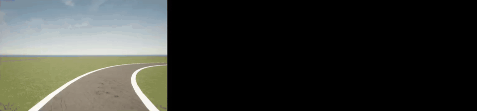
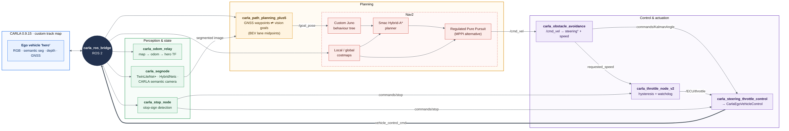

<div align="center">

# Juno Digital Twin

**A CARLA simulation twin of the Juno autonomous driving stack**<br>
Built for the **[H2politO](https://areeweb.polito.it/didattica/h2polito/)** Shell Eco-marathon team at Politecnico di Torino

[](https://docs.ros.org/en/humble/index.html)
[](https://carla.org/)
[](https://docs.nav2.org/)
[](https://www.python.org/)
[](https://github.com/chequanghuy/TwinLiteNetPlus)

</div>

<p align="center">
  
  <br>
  <sub>CARLA camera · road segmentation · bird's-eye lane detection with planned midpoints</sub>
</p>

---

## What is this?

**Juno** is H2politO's autonomous Shell Eco-marathon vehicle. On the real car, a ZED 2i camera, TwinLiteNet+ road segmentation, a YOLO stop-sign detector, and u-blox GNSS feed a ROS 2 planning stack. That stack drives Trinamic stepper motors (steering and braking) over CAN.

Testing planning and obstacle avoidance on the real vehicle is slow, risky, and depends on track time. **This repository is a digital twin of that stack in the [CARLA](https://carla.org/) simulator.** The perception, planning, and control nodes are ported to run against simulated sensors. Topic names and command interfaces match the real vehicle, such as the steering angle in degrees, the throttle-valve command, and the stop/brake flag. That way, algorithms developed here carry over to the car with minimal changes.

On top of the original lane-following pipeline, the twin adds a **Nav2-based obstacle-avoidance layer**. It uses a costmap built from the vehicle's sensors, a Hybrid-A\* planner, and a tuned Regulated Pure Pursuit controller, all configured for an Ackermann car with no reverse gear.

## Architecture

<p align="center">
  <a href="docs/media/architecture.svg"></a>
</p>

<sub>Diagram source: <a href="docs/media/architecture.mmd"><code>docs/media/architecture.mmd</code></a>. Regenerate with
<code>npx -y @mermaid-js/mermaid-cli -i docs/media/architecture.mmd -c docs/media/mermaid-config.json -b white -s 3 -o docs/media/architecture.png</code></sub>

## What I built

- **Sim-to-real port of the Juno stack.** I ported the team's perception, stop-sign, throttle, and steering nodes from the real vehicle's hardware (ZED 2i, CAN steppers) to CARLA sensors and `CarlaEgoVehicleControl`, while keeping the real car's topic interface.
- **Pluggable road segmentation** (`carla_segnode`). I integrated TwinLiteNet+, HybridNets, YOLOPv2, and TwinLiteNet. A `carla_native` mode instead uses CARLA's semantic camera as ground truth, which separates planning bugs from perception errors.
- **Hybrid GNSS / vision planner** (`carla_path_planning_plus5`). It converts GNSS fixes to UTM and follows recorded waypoints. When GNSS quality degrades, it falls back to vision goals computed from lane midpoints in a bird's-eye view. Goals are transformed from the camera optical frame into `map` through TF.
- **Nav2 obstacle avoidance for an Ackermann vehicle.** I configured costmaps with the real vehicle footprint, a Smac Hybrid-A\* planner, and a Regulated Pure Pursuit controller (lookahead tuned to 7.5 m), plus an MPPI alternative. I also wrote **custom behaviour trees** that replace spin and back-up recoveries, which a car without reverse can't perform, with clear-costmap, wait, and drive-forward.
- **TF and odometry fixes** (`carla_odom_relay`). CARLA publishes absolute world poses in `map`. This node re-bases odometry at spawn and publishes a REP-105 `map → odom → hero` chain so Nav2 costmaps line up with sensor data.
- **Control bridge.** It converts Nav2's `/cmd_vel` into a steering angle through a bicycle model (wheelbase 1.6 m, ±10° limit) and a speed request. A throttle node with hysteresis and a safety watchdog mirrors the real car's on/off intake-valve control.
- **Tooling.** I used an interactive BEV homography calibration tool (vanishing-point based) that our original repo used, a GNSS waypoint recorder and CSV export, waypoint visualisation, RTAB-Map depth mapping launch files, and CARLA Python API scripts for placing test obstacles.

## Repository layout

```
juno-digital-twin/
├── juno_digital_twin/            # ROS 2 package (ament_python)
│   ├── juno_digital_twin/        # nodes: segmentation, planning, avoidance, control, TF
│   ├── launch/                   # launch files (carla_plus5.launch.py is the current pipeline)
│   │   └── configs/              # Nav2 params (RPP, MPPI), costmaps, behaviour trees, RViz
│   ├── config/objects.json       # ego vehicle + sensor rig spawned in CARLA
│   ├── calibration_setup/        # BEV homography + path calibration tools
│   └── python_api_scripts/       # CARLA Python API helpers
├── shared_objects/               # shared utils: lane geometry, BEV, models, topic names
│   └── shared_objects/{TwinLiteNetPlus,HybridNets}   # model submodules
└── rtabmap_ros/                  # submodule (H2politO fork)
```

The planner versions are kept to show how the approach evolved:

1. **base**: direct steering from lane midpoints.
2. **plus1**: curvature-aware steering.
3. **plus2**: vision goals published to Nav2.
4. **plus3**: switches between lane following and Nav2 avoidance when obstacles appear in the costmap.
5. **plus5**: GNSS waypoint navigation with vision fallback.

## Getting started

**Requirements:** Ubuntu 22.04, ROS 2 Humble, CARLA 0.9.15, Nav2, and an NVIDIA GPU for the learned segmentation models. The `carla_native` mode needs no GPU.

```bash
# 1. Workspace with the CARLA ROS bridge (dependency) and this repo
mkdir -p ~/Workspace/ros-bridge/src && cd ~/Workspace/ros-bridge/src
git clone --recurse-submodules https://github.com/carla-simulator/ros-bridge.git
git clone --recurse-submodules https://github.com/betelgeuse009/juno-digital-twin.git

# 2. Dependencies + build
cd .. && source /opt/ros/humble/setup.bash
rosdep install --from-paths src --ignore-src -r -y
pip install torch torchvision ultralytics pyproj scipy
colcon build --symlink-install && source install/setup.bash
```

**Run** (with a CARLA server already running):

```bash
# CARLA bridge + ego vehicle with the Juno sensor rig
ros2 launch carla_ros_bridge carla_ros_bridge.launch.py host:=<carla_ip> town:=<map>
ros2 launch carla_spawn_objects carla_spawn_objects.launch.py \
    objects_definition_file:=$(ros2 pkg prefix juno_digital_twin)/share/juno_digital_twin/config/objects.json

# Perception + Nav2 + avoidance + actuation
ros2 launch juno_digital_twin carla_plus5.launch.py

# Send a Nav2 goal 15 m ahead of the car
python3 juno_digital_twin/juno_digital_twin/send_goal_pose.py
```

> **Note:** This is research code from active development. Some config and model-weight paths are absolute and assume the workspace lives at `/home/ubuntu/Workspace/ros-bridge` (the development container). Adjust them in the launch files and nodes if your layout differs.

## Acknowledgements

- [carla-simulator/ros-bridge](https://github.com/carla-simulator/ros-bridge), the ROS 2 ↔ CARLA bridge this project builds on
- [TwinLiteNet+](https://github.com/chequanghuy/TwinLiteNetPlus) and [HybridNets](https://github.com/datvuthanh/HybridNets) for road and lane segmentation
- [Nav2](https://github.com/ros-navigation/navigation2) and [RTAB-Map](https://github.com/introlab/rtabmap_ros)
- The H2politO autonomous driving team, for the real-vehicle Juno stack this twin mirrors

## Author

**Erdeniz Esmeli**: [GitHub](https://github.com/betelgeuse009) · erdenizesmeli@proton.me
